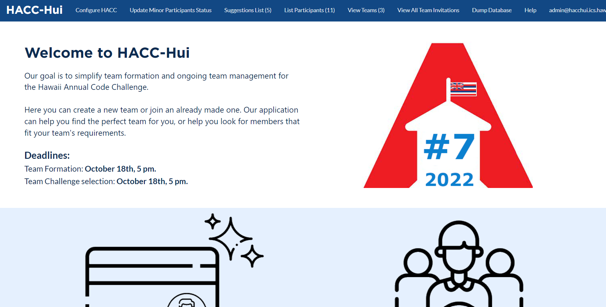

* [Team members](#team-members)
* [Project Goals](#project-goals)
* [End Result](#end-result)
* [Mockup Pages](#mockup-pages)

## Team Members ##

- Winston Co
- Ruben Jacobo
- Raymond Lai
- Braydon Nagasako
- Kevin Nahainu
- Kairi Tanaka
- Nathaniel Tomchak

## Project Goals ##

The Hawaii Annual Coding Challenge or HACC for short is an annual competition in which participants form groups and come up with coding solutions for challenges provided by the HACC staff. Previously, the HACC used a website developed by students as their main website for various different purposes. However, this website is a bit outdated. Our goal with this project is to take the HACC hui website and update it to provide a smooth and interactive experience for future participants of the Hawaii Annual Coding Challenge. 

## End Result ##

By the end we will have a functional website which fulfills all basic requirements for a Hawaii Annual Coding Challenge website. Code will no longer have classes, but instead utilize arrow functions. All semantic-UI elements will be replaced with UI elements from Boostrap instead. Finally, this new HACC hui website will have the ability to completely reset all data from the HACC Hui databases, allowing a quick and easy reset for the next year. 

## Mockup Pages ##

* ### Landing Page

